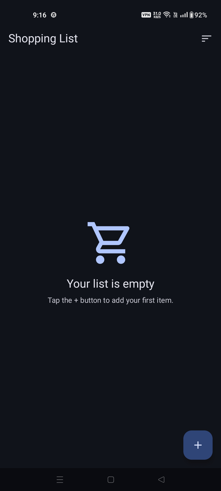
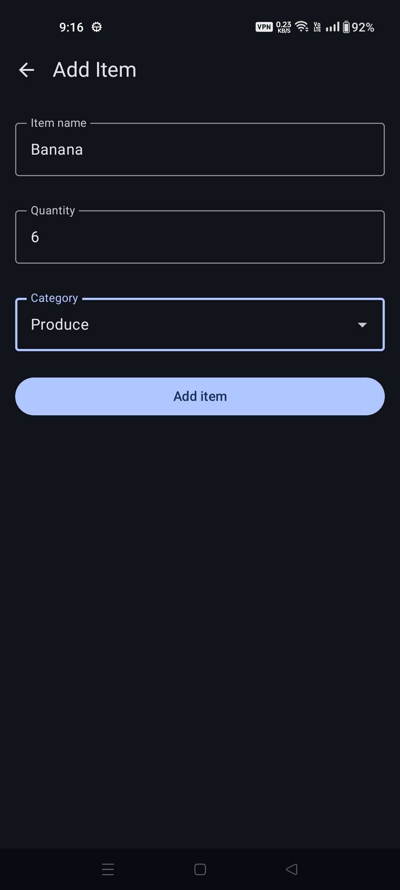
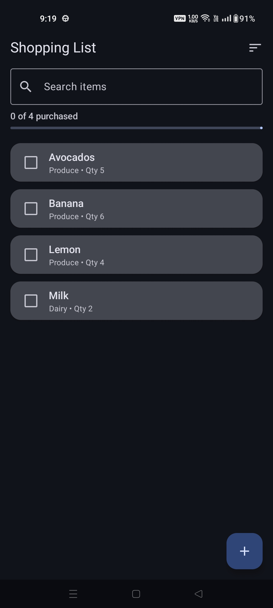
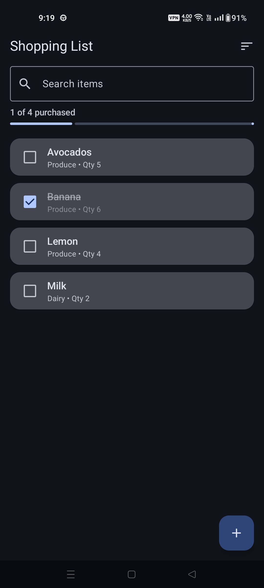

# 🛒 Shopping List

A production-grade Android shopping list app built with **Kotlin**, **Jetpack Compose (Material 3)**, and a clean **MVVM** architecture. It supports adding, editing, and deleting items, marking them as purchased, searching, sorting, category grouping, and swipe-to-delete with an undo action — all backed by an offline **Room** database and wired together with **Hilt** dependency injection.

## ✨ Features

- **Add / Edit / Delete items** — name, quantity, and category per item.
- **Mark as purchased** — tap the checkbox to toggle; purchased items are struck through.
- **Live progress** — a header shows `X of Y purchased` with a progress bar.
- **Search** — filter the list instantly as you type.
- **Sort** — by newest, name (A–Z), category, or unpurchased-first.
- **Categories** — Produce, Dairy, Bakery, Meat & Fish, Frozen, Pantry, Beverages, Household, Other.
- **Swipe-to-delete with Undo** — items disappear instantly and are only removed from the database if the undo Snackbar is dismissed without tapping *Undo* (optimistic delete).
- **Empty state** — friendly illustration and hint when the list has no items.
- **Light & dark theming** — Material 3 dynamic color where supported.
- **Offline-first** — all data persists locally via Room.

## 📱 Screenshots

> Upload your screenshots into the `screenshots/` folder using the filenames below and they will render automatically.

| Empty state | Add item | Shopping list | Purchased item |
|:---:|:---:|:---:|:---:|
|  |  |  |  |

## 🏗️ Architecture

The app follows a layered **MVVM** structure with a clear separation between the domain, data, and UI layers, plus a dedicated DI module.

```
com.example.shoppinglist
├── domain/                     # Business models & contracts (no framework deps)
│   ├── model/                  # ShoppingItem, Category
│   └── repository/             # ShoppingRepository interface
├── data/                       # Persistence & data mapping
│   ├── local/                  # Room: ShoppingDatabase, ShoppingDao, ShoppingItemEntity
│   ├── mapper/                 # Entity ⇄ domain mapping
│   └── repository/             # ShoppingRepositoryImpl
├── di/                         # Hilt module (AppModule)
└── ui/                         # Compose UI (unidirectional data flow)
    ├── list/                   # ShoppingListScreen, ViewModel, UiState
    ├── additem/                # Add/Edit screen & ViewModel
    ├── components/             # Reusable composables (cards, search, sort, empty state…)
    ├── navigation/             # NavHost & routes
    └── theme/                  # Color, Type, Theme
```

**Data flow:** the UI observes immutable `UiState` from the `ViewModel`, which combines the Room-backed repository stream with search/sort/pending-delete state. User actions call `ViewModel` functions, which update the repository or in-memory state — a single source of truth with unidirectional data flow.

**Optimistic delete:** swiping an item adds its id to an in-memory `pendingDeletes` set so it vanishes from the list immediately while staying in the database. Tapping *Undo* removes the id (instant, lossless restore); letting the Snackbar time out commits the real database delete.

## 🧰 Tech Stack

| Concern | Library |
|---|---|
| Language | Kotlin |
| UI | Jetpack Compose + Material 3 |
| Architecture | MVVM + unidirectional data flow |
| DI | Hilt |
| Persistence | Room |
| Navigation | Navigation Compose |
| Async | Kotlin Coroutines + Flow |

## 🚀 Getting Started

### Prerequisites

- Android Studio (latest stable recommended)
- JDK 11+
- An Android device or emulator running **API 24+** (minSdk 24)

### Build & Run

```bash
# Clone the repo
git clone https://github.com/<your-username>/ShoppingList.git
cd ShoppingList

# Build a debug APK
./gradlew assembleDebug        # macOS/Linux
gradlew.bat assembleDebug      # Windows

# Install on a connected device/emulator
./gradlew installDebug
```

Or simply open the project in Android Studio and click **Run ▶**.

### Run tests

```bash
./gradlew test                 # unit tests
./gradlew connectedAndroidTest # instrumented tests (device/emulator required)
```

## 📂 Project Configuration

- Dependencies are managed via the **version catalog** at `gradle/libs.versions.toml`.
- `minSdk = 24`, `compileSdk = 37`, `targetSdk = 37`.
- `namespace` / `applicationId`: `com.example.shoppinglist`.

## 📄 License

Released under the [MIT License](LICENSE).
